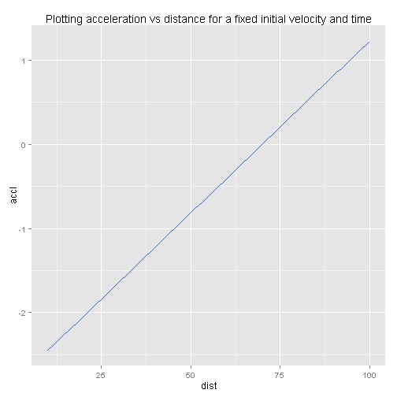

Presentation1 : To understand the relation of average acceleration a body undergoes over a distance
========================================================
author: Siddharth Prasad Rath
date: 21st February 2015


Introduction 
========================================================

- The following presentation will give you an understanding of how much you average acceleration was over a journey
- The kinematic parameters of concern are the initial velocity from the point in time when we start measuring, distance travelled and the time taken to travel that distance
- So basically, we try to find out how the rate at which the body had to change its velocity to cover a certain distance over a period of time

Formula
========================================================

- The formula for geeting average acceleration after initially starting at 'u' velocity, covering 'd' distance in 't' time would be - $(d-u*t)*(2/t^2)$
- The slide next shows how the acceleration varies with distance for a fixed initial velocity of 10 metres per second and fixed time of 7 seconds taken to cover the distance


Slide with Code
========================================================


```r
dist<-seq(from=10,to=100,by=1)
accl<-as.double((dist-10*7)*(2/7^2))
dist<-data.frame(dist)
accl<-data.frame(accl)
data_final<-cbind(dist,accl)
data_final
```

```
   dist     accl
1    10 -2.44898
2    11 -2.40816
3    12 -2.36735
4    13 -2.32653
5    14 -2.28571
6    15 -2.24490
7    16 -2.20408
8    17 -2.16327
9    18 -2.12245
10   19 -2.08163
11   20 -2.04082
12   21 -2.00000
13   22 -1.95918
14   23 -1.91837
15   24 -1.87755
16   25 -1.83673
17   26 -1.79592
18   27 -1.75510
19   28 -1.71429
20   29 -1.67347
21   30 -1.63265
22   31 -1.59184
23   32 -1.55102
24   33 -1.51020
25   34 -1.46939
26   35 -1.42857
27   36 -1.38776
28   37 -1.34694
29   38 -1.30612
30   39 -1.26531
31   40 -1.22449
32   41 -1.18367
33   42 -1.14286
34   43 -1.10204
35   44 -1.06122
36   45 -1.02041
37   46 -0.97959
38   47 -0.93878
39   48 -0.89796
40   49 -0.85714
41   50 -0.81633
42   51 -0.77551
43   52 -0.73469
44   53 -0.69388
45   54 -0.65306
46   55 -0.61224
47   56 -0.57143
48   57 -0.53061
49   58 -0.48980
50   59 -0.44898
51   60 -0.40816
52   61 -0.36735
53   62 -0.32653
54   63 -0.28571
55   64 -0.24490
56   65 -0.20408
57   66 -0.16327
58   67 -0.12245
59   68 -0.08163
60   69 -0.04082
61   70  0.00000
62   71  0.04082
63   72  0.08163
64   73  0.12245
65   74  0.16327
66   75  0.20408
67   76  0.24490
68   77  0.28571
69   78  0.32653
70   79  0.36735
71   80  0.40816
72   81  0.44898
73   82  0.48980
74   83  0.53061
75   84  0.57143
76   85  0.61224
77   86  0.65306
78   87  0.69388
79   88  0.73469
80   89  0.77551
81   90  0.81633
82   91  0.85714
83   92  0.89796
84   93  0.93878
85   94  0.97959
86   95  1.02041
87   96  1.06122
88   97  1.10204
89   98  1.14286
90   99  1.18367
91  100  1.22449
```

Slide With Plot
========================================================

 
